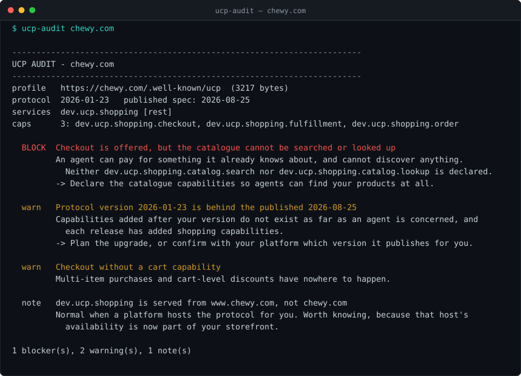

# ucp-audit

[](https://github.com/dkautomation23/ucp-audit/actions/workflows/ci.yml)



Checks whether your shop is actually reachable by AI shopping agents — and tells
you what would make one skip it.

```bash
npx ucp-audit yourshop.com
```

No runtime dependencies, no API key, no account. TypeScript, Node's own test
runner, 43 tests.

## Why

Since January 2026, Google and Shopify have been shipping the
[Universal Commerce Protocol](https://ucp.dev): every business publishes a
machine-readable profile at `/.well-known/ucp` declaring which services and
capabilities it supports, and agents read it to decide what they can do with
that shop. The protocol calls this *permissionless onboarding* — no registration,
no handshake, just the profile.

Which means the failure mode is silence. If your profile says you can take a
payment but not that your catalogue can be searched, an agent will never surface
your products and nothing will tell you. There is no error page. There is no
warning in an admin panel. There is just no traffic.

This reads the profile the way an agent does and says what an agent would
conclude.

## A real example

`chewy.com`, a multi-billion-dollar retailer, on the day this was written:

```console
$ ucp-audit chewy.com

------------------------------------------------------------------------
UCP AUDIT - chewy.com
------------------------------------------------------------------------
profile   https://chewy.com/.well-known/ucp  (3217 bytes)
protocol  2026-01-23   published spec: 2026-08-25
services  dev.ucp.shopping [rest]
caps      3: dev.ucp.shopping.checkout, dev.ucp.shopping.fulfillment, dev.ucp.shopping.order

  BLOCK  Checkout is offered, but the catalogue cannot be searched or looked up
         An agent can pay for something it already knows about, and cannot
         discover anything. Neither dev.ucp.shopping.catalog.search nor
         dev.ucp.shopping.catalog.lookup is declared.
         -> Declare the catalogue capabilities so agents can find your products at all.

  warn   Protocol version 2026-01-23 is behind the published 2026-08-25
  warn   Checkout without a cart capability
  note   dev.ucp.shopping is served from www.chewy.com, not chewy.com

1 blocker(s), 2 warning(s), 1 note(s)
```

And the same command against a shop that has it right:

```console
$ ucp-audit allbirds.com

protocol  2026-08-25   published spec: 2026-08-25
services  dev.ucp.shopping [mcp, embedded]
caps      8: dev.shopify.catalog, dev.ucp.shopping.cart, dev.ucp.shopping.catalog.lookup,
          dev.ucp.shopping.catalog.search, dev.ucp.shopping.checkout, …

  note   dev.ucp.shopping is served from weareallbirds.myshopify.com, not allbirds.com

0 blocker(s), 0 warning(s), 1 note(s)
```

Eight capabilities against three, and the difference is whether an agent can find
anything to buy.

## What it checks

**Can an agent buy from you at all**

- Checkout offered without `catalog.search` or `catalog.lookup` — an agent can
  pay for what it already knows about and discover nothing. Blocker.
- Only half the catalogue interface declared. Search finds candidates, lookup
  resolves a known product; agents use both.
- Checkout with no cart capability — multi-item orders and cart-level discounts
  have nowhere to happen.

**Does the profile contradict itself**

- A capability whose `requires.protocol.min` is newer than the version you
  declare. A platform reading that sees a capability it must not use, and skips
  it without telling anyone.
- `extends` pointing at a capability you do not offer.
- A capability dated ahead of the protocol version, or `supported_versions`
  listing something newer than what you declare.

**Is the plumbing sound**

- A plaintext `http://` endpoint — payment and customer data unencrypted.
- A transport declared with no endpoint to send anything to.
- With `--probe`, every URL the profile points at is checked for a response.
- The endpoint being on another host (usually your platform) is reported as a
  note, not a fault — but that host's availability is now part of your shop.

**Are you falling behind**

Your protocol version against the published spec. Each release has added
shopping capabilities; the ones added after your version do not exist as far as
an agent is concerned.

## A list of shops at a time

An agency running twenty client stores needs one command, not twenty:

```console
$ ucp-audit --batch shops.txt --csv survey.csv

auditing 6 domain(s), 4 at a time

     1/6  allbirds.com                       8 cap(s), 0 blocker(s)
     2/6  glossier.com                       9 cap(s), 0 blocker(s)
     3/6  ruggable.com                       no-profile
     4/6  chewy.com                          3 cap(s), 1 blocker(s), catalogue not searchable
     5/6  gymshark.com                       8 cap(s), 0 blocker(s)
     6/6  mejuri.com                         8 cap(s), 0 blocker(s)

6 domain(s)

  profile read and audited   5  (83%)
  no profile published       1  (17%)
  refused the check          0
  answered something else    0
  no answer                  0

Of the 5 audited:
  agents cannot search the catalogue   1  (20%)
  at least one blocker                 1  (20%)
  behind the published 2026-08-25       1  (20%)
```

The outcome of each domain is one of six, not a yes or no. **"We could not check
this shop" and "this shop is broken" are different facts**, and a shop that
refused the request never appears in the numerator of anything. That is the
difference between a survey and a number someone made up.

The CSV has one row per domain — outcome, protocol version, capability count,
whether the catalogue is searchable, blocker count and the first blocker — so it
opens in a spreadsheet and sorts by the column that matters to you.

Four requests at a time, with a pause, and the concurrency cannot be raised past
four however it is asked for. This walks up to other people's shops; it does so
politely or not at all.

## In CI, or in cron

Exit code is `1` when there is a blocker, `0` when there is not, `2` when there
is no profile to read. A batch run is a survey rather than a gate: it exits `0`
even when shops in it are broken, and `2` only if not one domain could be
checked at all.

```yaml
- run: npx ucp-audit yourshop.com
```

Your platform publishes this profile on your behalf and can change it without
telling you. A nightly check is the cheap half of the job.

## Safety

This tool follows URLs written by someone else, so it treats them accordingly.

- **It never requests a private address.** `localhost`, `127.0.0.0/8`,
  `10/8`, `172.16/12`, `192.168/16`, `169.254/16` (cloud metadata), `::1` and
  bare hostnames are refused and reported instead of fetched. Run from inside a
  company network, a profile pointing at `http://169.254.169.254/` would
  otherwise be a request-forgery primitive.
- **It sends no credentials**, ever, to anyone.
- **It caps the profile at 5 MB** rather than reading whatever arrives.
- **Keys named `__proto__`, `constructor` and `prototype` are dropped** from the
  downloaded document.
- **`--probe` is sequential with a pause between requests.** A checker that hits
  a shop with twenty parallel requests is indistinguishable from something worth
  blocking.

The test suite covers each of these. Nothing in it touches the network.

## Install

```bash
npx ucp-audit --help          # nothing to install

git clone https://github.com/dkautomation23/ucp-audit.git
cd ucp-audit && npm install && npm test
```

Node 22+.

| Flag | Meaning |
| --- | --- |
| `--batch FILE` | audit a list of domains, one per line; `#` comments and blanks ignored |
| `--csv FILE` | write the batch result as CSV, one row per domain |
| `--probe` | also check that every URL the profile declares resolves |
| `--file PATH` | audit a saved profile instead of fetching one |
| `--json FILE` | write the findings as JSON |
| `--spec-version V` | compare against this published version |
| `--timeout MS` | per request, default 15000 |
| `--quiet` | write the files, print nothing |

## Honest limits

- **It reads the profile, not your shop.** Whether your inventory is accurate,
  your prices are current or your checkout actually completes is not visible
  from `/.well-known/ucp`, and this does not pretend otherwise.
- **A clean result is not a guarantee of sales.** It means an agent can see and
  use what you declared. Whether it chooses your product is a different question
  with a different answer.
- **The published version is a build-time constant** (`--spec-version` overrides
  it). UCP ships dated releases; a stale copy of this tool will under-report how
  far behind you are, never over-report.
- **Only the shopping vertical is understood in detail.** The protocol reserves
  namespaces for other verticals whose specifications are still being written;
  those are read but not judged.
- **`--probe` checks that a URL answers, not that it answers correctly.** A 200
  from an endpoint says the address is live, not that the implementation behind
  it is right.
- **A batch result is a census of published profiles, nothing more.** A domain
  that refused the request, rate-limited it or did not answer is counted as
  unverified and never as broken. Shops behind a CDN that blocks unknown clients
  are therefore under-represented among the audited, and any percentage drawn
  from a batch has to say so.
- **Not affiliated with Google, Shopify or the UCP project.** This is an
  independent reader of a public specification.

## Licence

MIT
